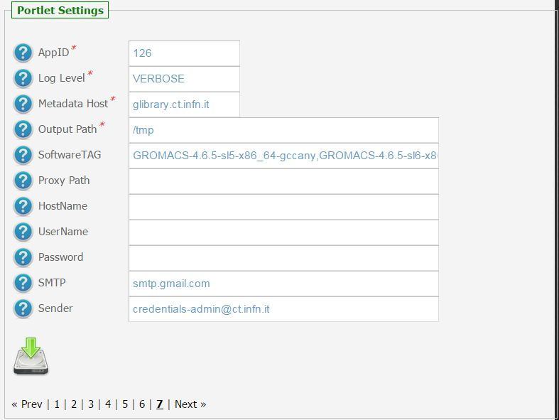

*********************
GROMACS v2.0.8 Docs
*********************

============
About
============

.. image:: images/GROMACS_logo.png
   :height: 100px
   :align: left
   :target: http://www.gromacs.org/
-------------

.. _GROMACS: http://www.gromacs.org/

GROMACS_ is versatile package to perform molecular dynamics, i.e. simulate the Newtonian equations of motion for systems with hundreds to millions of particles.

It is primarily designed for biochemical molecules like proteins, lipids and nucleic acids that have a lot of complicated bonded interactions, but since GROMACS is extremely fast at calculating the non-bonded interactions (that usually dominate simulations) many groups are also using it for research on non-biological systems, e.g. polymers.  

============
Installation
============
To install this portlet the WAR file has to be deployed into the application server.

As soon as the portlet has been successfully deployed on the Science Gateway the administrator has to configure:

- the list of e-Infrastructures where the application can be executed;

- some additional application settings.

1.) To configure a generic e-Infrastructure, the following settings have to be provided:

**Enabled**: A true/false flag which enables or disable the generic e-Infrastructure;

**Infrastructure**: The acronym to reference the e-Infrastructure;

**VOName**: The VO for this e-Infrastructure;

**TopBDII**: The Top BDII for this e-Infrastructure;

**WMS Endpoint**: A list of WMS endpoint for this e-Infrastructure (max. 10);

**MyProxyServer**: The MyProxyServer for this e-Infrastructure;

**eTokenServer**: The eTokenServer for this e-Infrastructure;

**Port**: The eTokenServer port for this e-Infrastructure;

**Serial Number**: The MD5SUM of the robot certificate to be used for this e-Infrastructure;

**WebDAV**: The EMI-3 DPM Grid Storage Element, with WebDAV interface, to be used for this e-Infrastructure;

In the following figure is shown how the portlet has been configured to run simulation on the EUMEDGRID-Support e-Infrastructure.

2.) To configure the application, the following settings have to be provided:

**AppID**: The ApplicationID as registered in the UserTracking MySQL database (GridOperations table);

**Log Level**: The log level for the application (e.g.: *INFO* or *VERBOSE*);

**Metadata Host**: The Metadata hostname where download/upload digital-assets (e.g. *glibrary.ct.infn.it*);

**Software TAG**: The list of software tags requested by the application;

**SMTP Host**: The SMTP server used to send notification to users;

**Sender**: The FROM e-mail address to send notification messages about the jobs execution to users;

.. _CHAIN-REDS: https://science-gateway.chain-project.eu/
.. _gLibrary: https://glibrary.ct.infn.it/

In the figure below is shown how the application settings have been configured to run on the CHAIN-REDS_ Science Gateway.

============
Usage
============

To run a molecular dynamics simulations with GROMACS_ the user has to:

- click on the third accordion of the portlet,

- select the GROMACS_ release to use (e.g. *v4.6.5* or *v5.0.4*),

- upload the input *macro* file *(.tpr)*.

For demonstrative use cases, the user can also click on *'Run demo'* and execute a simulation with some pre-configured inputs.

Each molecular dynamic simulation will produce:

- *std.txt*: the standard output file;

- *std.err*: the standard error file;

- *gromacs.log*: the application log file;

- some additional log files;

- *.tar.gz*: the application results available through the gLibrary_ Metadata Server.

A typical *simulation* produces the following files:

.. code:: bash

        ]$ tree GROMACSSimulationStarted_147118/
        GROMACSSimulationStarted_147118/
        ├── curl.log
        ├── env.log
        ├── gromacs.log
        ├── output.README
        ├── std.err
        └── std.txt

.. _here: https://science-gateway.chain-project.eu/browse

To inspect GROMACS_ log files:

- *navigate* the digital repository for the application clicking [ here_ ];

- *select* the digital assets of any interest for downloading as shown in the figure below:

============
References
============

.. _1: http://agenda.ct.infn.it/event/1110/

* CHAIN-REDS Conference: *"Open Science at the Global Scale: Sharing e-Infrastructures, Sharing Knowledge, Sharing Progress"* – March 31, 2015 – Brussels, Belgium [1_];

============
Support
============
Please feel free to contact us any time if you have any questions or comments.

.. _INFN: http://www.ct.infn.it/
.. _DFA: http://www.dfa.unict.it/
.. _AUC: https://www.annauniv.edu/BiotechCentre/

:Authors:
 `Giuseppe LA ROCCA <mailto:giuseppe.larocca@ct.infn.it>`_ - Italian National Institute of Nuclear Physics (INFN_),

 `Mario TORRISI <mailto:mario.torrisi@ct.infn.it>`_ - University of Catania (DFA_),

 `Sarath Kumar BASKARAN <mailto:bskumar.tech@gmail.com>`_ - Centre for Biotechnology, Anna University, Chennai (AUC_),

:Version: v2.0.8, 2015

:Date: May 29th, 2015 15:54
